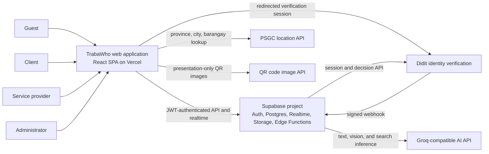
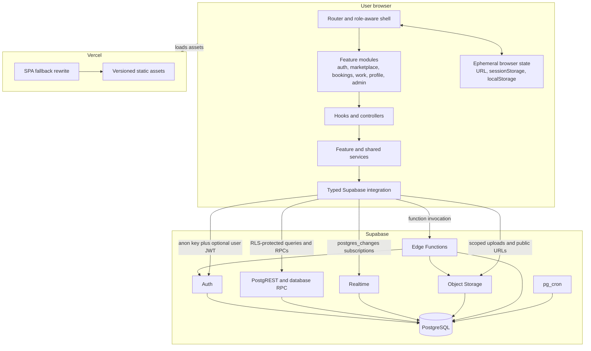
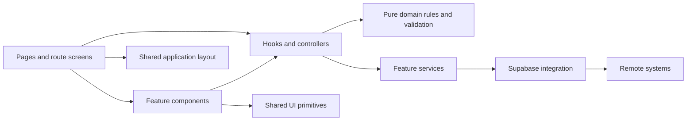
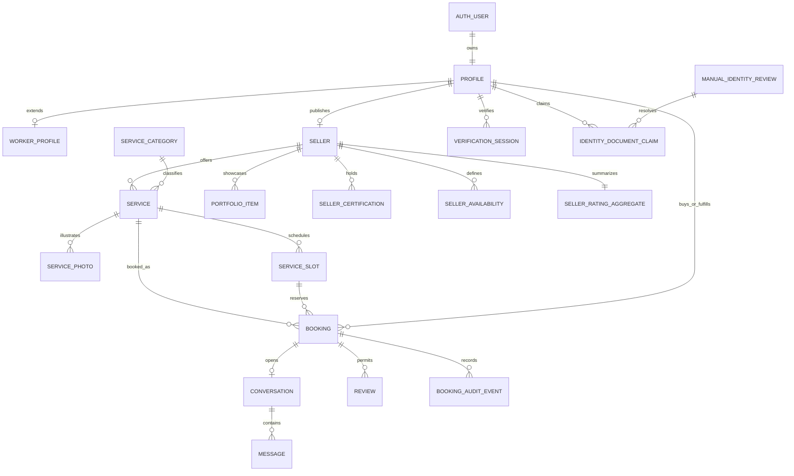
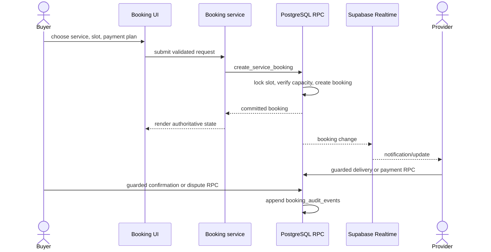
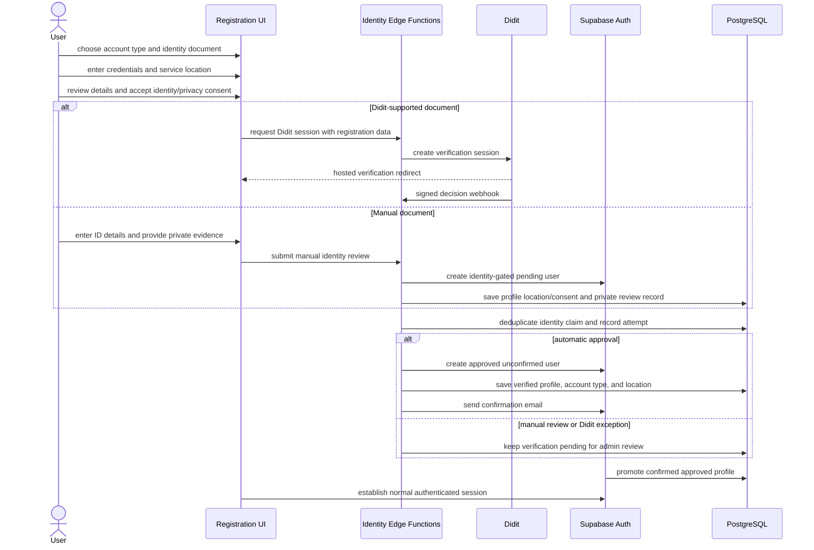
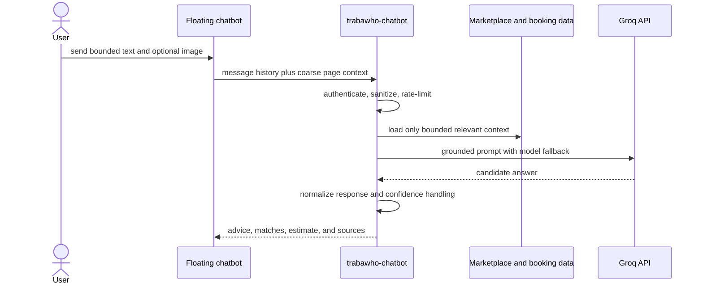
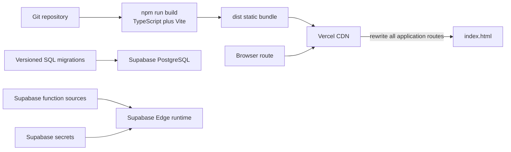

# TrabaWho System Architecture

Status: current-state reference
Last reviewed: 2026-09-14

This document describes the deployed TrabaWho architecture represented by the repository. It is descriptive, while the standards in [`../README.md`](../README.md) remain prescriptive and take precedence when the implementation changes.

## 1. Architecture summary

TrabaWho is a client-rendered service-marketplace SPA deployed as static assets on Vercel. The browser communicates directly with Supabase for authentication, row-level-secured application data, storage, realtime notifications, and database RPCs. Supabase Edge Functions hold privileged integration logic for identity verification and AI assistance. PostgreSQL functions and triggers own booking invariants that must remain atomic or resistant to client tampering.

The system is a modular frontend backed by a managed Supabase application backend. It should remain one deployable product until traffic, team ownership, or reliability requirements justify splitting a bounded context into a separate service.

## 2. System context

### Trust boundaries

- The browser is untrusted. Route guards improve navigation but never grant authorization.
- Supabase Auth issues the session JWT; PostgreSQL RLS and guarded RPCs enforce data access.
- Edge Functions may use the service-role key only after validating the request, its actor, input, replay protection, and rate limits.
- Didit webhook payloads cross an external trust boundary and require signature and freshness checks.
- AI output is advisory. It cannot finalize bookings, payments, prices, identity decisions, or administrative actions.

## 3. Runtime containers

## 4. Frontend module architecture

New and migrated code follows this dependency direction:

Responsibilities:

| Layer | Owns | Must not own |
| --- | --- | --- |
| `src/app` | providers, URL routing, access-policy mapping, application composition | feature-specific business rules |
| `src/features/*/pages` | route-level screen composition | direct database access in migrated code |
| `src/features/*/components` | feature presentation and accessible interaction | cross-feature orchestration or authorization |
| `src/features/*/hooks` | async orchestration, transient UI state, loading and error states | persistent business invariants |
| `src/features/*/services` | Supabase queries, RPC calls, remote DTO mapping | React rendering |
| domain utilities | validation, pricing, allowed state transitions, deterministic calculations | I/O or React state |
| `src/components/ui` | shadcn-based, product-agnostic primitives | marketplace knowledge |
| `src/integrations/supabase` | configured client and generated/checked-in database contracts | feature-specific presentation |

The current application still uses `useAppNavigation` and `viewMap` as a compatibility adapter while legacy JavaScript screens migrate. This is an implementation bridge, not the target boundary. URL state and typed route policies are the long-term navigation authority.

## 5. Backend responsibilities

### Supabase Auth

- Email/password signup, login, password reset, session persistence, and token refresh.
- Auth events seed or promote application profile records through database triggers.
- Application roles live in profile data and are enforced at the database boundary, not trusted from client input.

### PostgreSQL and PostgREST

- Durable system of record for users, providers, services, schedules, bookings, conversations, messages, reviews, and identity workflows.
- RLS scopes records to owners, booking participants, public marketplace readers, or administrators.
- RPCs serialize booking creation and protect booking, payment, delivery, dispute, and completion transitions.
- Immutable booking audit events provide a server-owned history of sensitive workflow changes.

### Realtime

- The browser subscribes to booking, conversation, and message changes.
- Realtime accelerates UI updates only; an initial query and later refetch remain the recovery path.
- RLS remains the source of subscription visibility.

### Storage

| Bucket | Visibility | Purpose |
| --- | --- | --- |
| `profile-photos` | public URL after owner upload | profile avatars |
| `portfolio` | public URL after owner upload | provider portfolio media |
| `review-images` | public URL after reviewer upload | review evidence/media |
| `identity-manual` | private | identity document and selfie submissions |

### Edge Functions

| Function | Responsibility | Privilege boundary |
| --- | --- | --- |
| `create-didit-session` | create or inspect a Didit verification session and record the attempt | public-signup validation, nonce, rate limits; server secrets |
| `create-unverified-user` | reconcile verification results, create the Auth user/profile, and send confirmation | service-role writes after identity checks |
| `didit-webhook` | ingest Didit decisions idempotently | signed, fresh webhook; event deduplication |
| `manual-identity-review` | validate/upload manual documents, list the admin queue, and authorize review decisions | private storage and service-role records with an admin-role check |
| `verification-redirect` | safely return the user to the web application | strips sensitive API parameters |
| `trabawho-chatbot` | sanitize chat input, load bounded marketplace/booking context, call model fallbacks, and return structured assistance | provider API key and service-role access stay server-side |

#### Didit v3 integration contract

- Configure a published KYC workflow in the Didit Console with ID verification, liveness, and face matching. Store its stable UUID in `DIDIT_WORKFLOW_ID`; runtime code must not silently select or create a different workflow.
- `create-didit-session` calls `POST https://verification.didit.me/v3/session/` with `x-api-key`, a stable pseudonymous `vendor_data`, `callback_method: both`, and the selected Philippine document restriction through `expected_details` (`ID`, `P`, or `DL`).
- Required Edge Function secrets are `DIDIT_API_KEY`, `DIDIT_WORKFLOW_ID`, `DIDIT_WEBHOOK_SECRET`, `SUPABASE_URL`, `SUPABASE_ANON_KEY`, `SUPABASE_SERVICE_ROLE_KEY`, and `TRABAWHO_APP_URL`.
- Configure a public HTTPS Didit v3 webhook destination for `status.updated` and `data.updated`. The handler requires a fresh `X-Timestamp`, prioritizes the full-payload `X-Signature-V2`, deduplicates `event_id`, and re-fetches `/v3/session/{session_id}/decision/` before using a deprecated simple-signature payload.
- Treat the returned hosted `url` and embedded session token as secrets. The URL is stored only in the private verification session record and the registering browser's session state; logs redact it.
- The registration review explicitly identifies Didit as the verification provider and links its verification privacy notice and end-user terms before biometric capture.

## 6. Data domains

The diagram groups `auth.users` as `AUTH_USER` and omits some optional foreign-key detail for readability. The migration files are authoritative for exact columns, constraints, policies, and relationships.

## 7. Critical flows

### Booking creation and lifecycle

Client-side code can propose a transition, but only database RPCs and triggers may commit sensitive lifecycle fields. The 15-minute `pg_cron` job auto-confirms eligible delivered bookings after rechecking payment, dispute, schedule version, and due time.

### Identity-first registration

### AI assistance

## 8. Deployment and configuration

Browser configuration is limited to `VITE_SUPABASE_URL` and `VITE_SUPABASE_ANON_KEY`. Service-role credentials, Didit credentials, webhook secrets, hashing/nonces, and Groq keys belong only in Supabase-managed secrets. The Vercel rewrite in `vercel.json` makes client-side routes refresh-safe.

## 9. Quality and operational model

- `npm run check` is the repository quality gate: typecheck, lint, unit/component tests, file-size policy, and production build.
- Playwright journeys cover the relevant user path separately and must run before a behavior change is complete.
- Safe user-facing errors are produced at feature boundaries; diagnostic detail must not include tokens, raw headers, document data, or private identifiers.
- Booking audit records and identity registration attempts provide domain-level auditability. There is no dedicated application observability backend documented in this repository, so production logging and alert ownership should be defined before higher-scale operation.
- Network failures must leave authoritative state in Supabase and allow a query/refetch recovery. Realtime events and AI responses are never the sole durable record.

## 10. Current constraints and evolution path

The architecture is intentionally documented as both the current system and the direction for ongoing migration.

1. Finish the JavaScript-to-strict-TypeScript migration and remove the `viewMap` compatibility adapter.
2. Move remaining direct Supabase calls out of pages/components and into feature services.
3. Regenerate or expand `database.types.ts` after backend migrations; it currently models the core marketplace tables but not every identity and booking-audit addition.
4. Keep booking/payment transitions database-centered. A real online payment provider must enter through a verified server webhook that calls the service-role-only payment RPC; the current UI identifies its GCash behavior as sandboxed.
5. Add structured monitoring for Edge Function failure rates, webhook rejection/replay, auth anomalies, booking RPC errors, cron health, and model-provider latency/cost.
6. Split services only at established domain boundaries. Identity, payments, or AI are the likely first candidates because they hold distinct secrets, failure modes, and compliance concerns.

## 11. Source map

- Frontend entry and shell: `src/main.tsx`, `src/App.tsx`
- Route policy: `src/app/router/routes.ts`
- Feature modules: `src/features/*`
- Supabase client contract: `src/integrations/supabase/*`
- Edge Functions: `supabase/functions/*`
- Database history and policy: `supabase/migrations/*`
- Vercel build and SPA routing: `vercel.json`
- Canonical engineering standards: `docs/standards/*`
